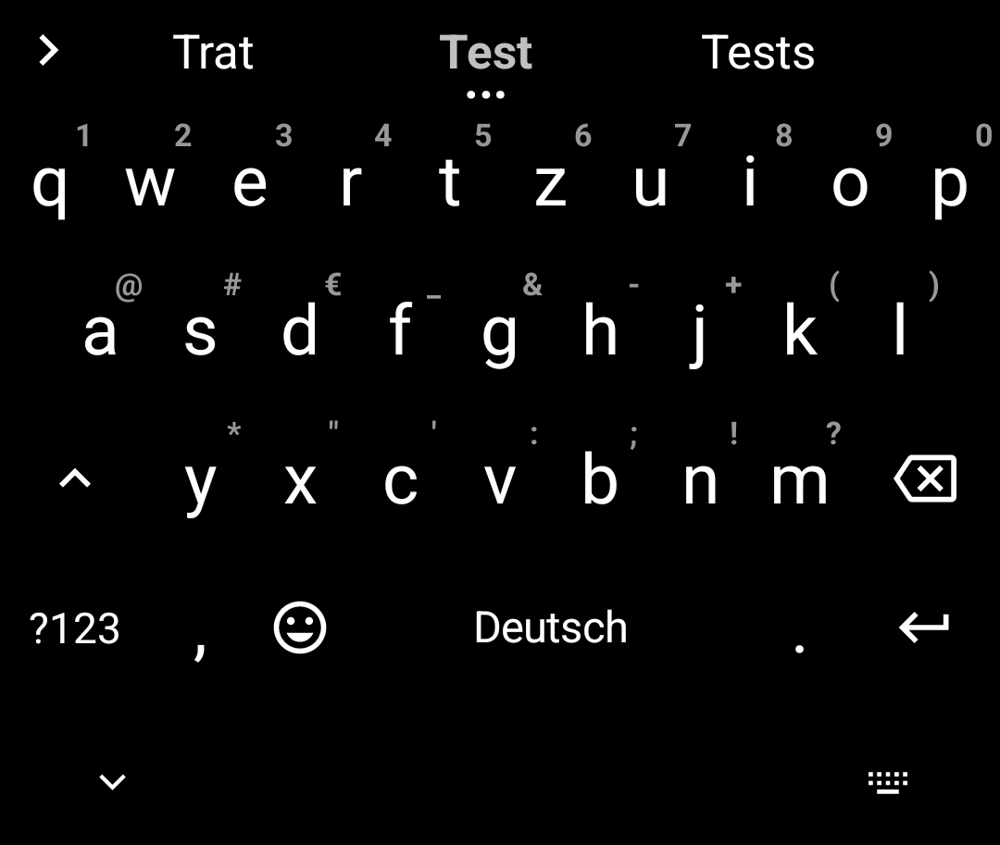

# AndroidFossSTTandKeyboard

This is my Foss setup to replace Gboard, Google Voice input, Gboard IME (STT Keyboard), Google TTS, Gboard with spell checker (right now a extra keyboard is used here)

Main Repo: https://codeberg.org/marvin1099/AndroidFossSTTandKeyboard  
Backup Repo: https://github.com/marvin1099/AndroidFossSTTandKeyboard

# Used Apps
Keyboard:  
https://github.com/florisboard/florisboard  
Voice Input:  
https://github.com/sogaiu/vosk-android-service/tree/builds/builds  
IME keyboard:  
https://github.com/ElishaAz/Sayboard   
TTS:  
https://github.com/espeak-ng/espeak-ng  

Extra keyboard with spell checker,  
since is not yet integrated into florisboard,  
is still usefull with with florisboard,  
since it still marks words that are incorect:  
https://github.com/Helium314/HeliBoard  
Right now i'm actually using HeliBoard becaulse  
florisboard is taking a lot of time to add spellchecking  

# Screenshots
| Florisboard | Voice Input | IME Keyboard |
|:-----------:|:-----------:|:------------:|
|  |  |  |

| TTS | TTS Settings (Darkq) | Spell Checker |
|:---:|:--------------------:|:-------------:|
|  |  |  |
